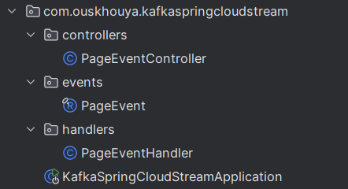

Activité Pratique N°1 - Event Driven Architecture avec KAFKA
---

Notre Objective dans un premier temps est d’utiliser Spring Cloud Stream avec Kafka pour produire et consommer des événements.

## 1. Creation d'un Producer KAFKA via un Rest Controler et d'un Producer KAFKA
- ### La structure de l'application:

- ### **Classe `PageEventController`**

```java
@RestController
public class PageEventController {
    private final StreamBridge streamBridge;

    @Autowired
    public PageEventController(StreamBridge streamBridge) {
        this.streamBridge = streamBridge;
    }

    @GetMapping("/publish")
    public PageEvent send(String name, String topic){
        PageEvent event = new PageEvent(
                name,
                Math.random()>0.5?"U1":"U2",
                new Date(), 10 + new Random().nextInt(1000));
        streamBridge.send(topic, event);
        return event;
    }
}
```

* `StreamBridge` : est un objet fourni par **Spring Cloud Stream** pour publier un message  sur un topic Kafka.
* La méthode `/publish` : Crée un objet **`PageEvent`** et l'initialise :
* Envoie cet objet vers le **topic Kafka** dont le nom est passé en paramètre (`topic`).

Exemple d’appel HTTP :

```
http://localhost:8080/publish?name=Bonjour&topic=T2
```


---

- ### **Record `PageEvent` **

```java
public record PageEvent(String name, String user, Date date, long duration) {
}
```

*  Record représentant un événement.

Exemple :

```json
{
  "name": "home-page",
  "user": "U1",
  "date": "2025-09-30T16:00:00",
  "duration": 487
}
```

---

- ### **Classe `PageEventHandler`**

```java
@Component
public class PageEventHandler {
    @Bean
    public Consumer<PageEvent> pageEventConsumer(){
        return (input) -> {
            System.out.println("*******************");
            System.out.println(input.toString());
            System.out.println("*******************");
        };
    }
}
```

=> **consommer les événements depuis Kafka**.

* `Consumer<PageEvent>` → définit un consumer qui reçoit les objets `PageEvent` depuis un **Topic Kafka**.
* Chaque fois qu’un `PageEvent` arrive, il est affiché dans la console.

Exemple d’affichage :

```
*******************
PageEvent[name=home-page, user=U1, date=Mon Sep 30 16:00:00 WET 2025, duration=487]
*******************
```

---

## 2. Creation d'un Supplier KAFKA

```java
@Bean
public Supplier<PageEvent> pageEventSupplier(){
    return () -> new PageEvent(
            Math.random() > 0.5 ? "P1" : "P2",
            Math.random() > 0.5 ? "U1" : "U2",
            new Date(),
            10 + new Random().nextInt(10000)
    );
}
```

=>  **générer en continu des événements PageEvent**.

Chaque 200 ms, il crée un nouvel objet `PageEvent`

Puis cet événement est **envoyé automatiquement dans le topic Kafka `T3`** .

---
