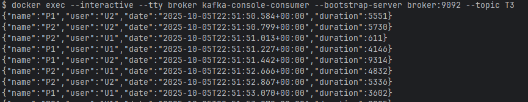
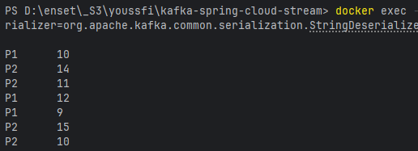

Activité Pratique N°1 - Event Driven Architecture avec KAFKA
---

Notre Objective dans cette activité est d’utiliser Spring Cloud Stream avec Kafka pour: 
- produire et consommer des événements.
- générer en continu des événements.
- transformer un flux d'évènements en un autre

````bash
> docker exec --interactive --tty broker kafka-console-consumer --bootstrap-server broker:9092 --topic R2
> docker exec --interactive --tty broker kafka-console-producer --bootstrap-server broker:9092 --topic R2
> docker exec --interactive --tty broker kafka-console-consumer --bootstrap-server broker:9092 --topic T4 --property print.key=true --property print.value=true --property key.deserializer=org.apache.kafka.common.serialization.StringDeserializer --property value.deserializer=org.apache.kafka.common.serialization.LongDeserializer
> docker exec --interactive --tty broker kafka-topics --bootstrap-server broker:9092 --list
````
## 1. Producer KAFKA via un Rest Controller et d'un Consumer KAFKA
- ### La structure de l'application:

- ### **Classe `PageEventController`**

```java
@RestController
public class PageEventController {
    private final StreamBridge streamBridge;

    @Autowired
    public PageEventController(StreamBridge streamBridge) {
        this.streamBridge = streamBridge;
    }

    @GetMapping("/publish")
    public PageEvent send(String name, String topic){
        PageEvent event = new PageEvent(
                name,
                Math.random()>0.5?"U1":"U2",
                new Date(), 10 + new Random().nextInt(1000));
        streamBridge.send(topic, event);
        return event;
    }
}
```

* `StreamBridge` : est un objet fourni par **Spring Cloud Stream** pour publier un message sur un topic Kafka.
* La méthode `/publish` : Crée un objet **`PageEvent`** et l'initialise :
* Envoie cet objet vers le **topic Kafka** dont le nom est passé en paramètre (`topic`).

Exemple d’appel HTTP :

```
http://localhost:8080/publish?name=Bonjour&topic=T2
```


---

- ### **Record `PageEvent` **

```java
public record PageEvent(String name, String user, Date date, long duration) {
}
```

*  Record représentant un événement.

Exemple :

```json
{
  "name": "home-page",
  "user": "U1",
  "date": "2025-09-30T16:00:00",
  "duration": 487
}
```

---

## 2. Consumer KAFKA

On peut consommer les messages envoyés par le Producer KAFKA via le console
```bash
docker exec --interactive --tty broker kafka-console-consumer --bootstrap-server broker:9092 --topic T2
```
ou bien, On utilise une methode dans Spring

- ### **Classe `PageEventHandler`**

```java
@Component
public class PageEventHandler {
    @Bean
    public Consumer<PageEvent> pageEventConsumer(){
        return (input) -> {
            System.out.println("*******************");
            System.out.println(input.toString());
            System.out.println("*******************");
        };
    }
}
```

=> **consommer les événements depuis Kafka**.

* `Consumer<PageEvent>` → définit un consumer qui reçoit les objets `PageEvent` depuis un **Topic Kafka**.
* Chaque fois qu’un `PageEvent` arrive, il est affiché dans la console.
* Configuration du Consumer et son Topic dans [application.properties](src/main/resources/application.properties)

```
spring.cloud.stream.bindings.pageEventConsumer-in-0.destination=T2

# Déclare quelles fonctions Spring Cloud doit activer
spring.cloud.function.definition=pageEventConsumer
```
Exemple d’affichage :

```
*******************
PageEvent[name=home-page, user=U1, date=Mon Sep 30 16:00:00 WET 2025, duration=487]
*******************
```


## 3. Supplier KAFKA

```java
@Bean
public Supplier<PageEvent> pageEventSupplier(){
    return () -> new PageEvent(
            Math.random() > 0.5 ? "P1" : "P2",
            Math.random() > 0.5 ? "U1" : "U2",
            new Date(),
            10 + new Random().nextInt(10000)
    );
}
```

=>  **générer en continu des événements PageEvent**.

Chaque 200 ms (précisé dans [application.properties](src/main/resources/application.properties)), il crée un nouvel objet `PageEvent`

Puis cet événement est **envoyé automatiquement dans le topic Kafka `T3`** .

* Configuration du Supplier, la durée et le Topic dans [application.properties](src/main/resources/application.properties)

```
spring.cloud.stream.bindings.pageEventSupplier-out-0.destination=T3
spring.cloud.stream.bindings.pageEventSupplier-out-0.producer.poller.fixed-delay=200

spring.cloud.function.definition=pageEventConsumer;pageEventSupplier
```
Pour vérifier, lancez un consumer KAFKA
```bash
docker exec --interactive --tty broker kafka-console-consumer --bootstrap-server broker:9092 --topic T3
```

---
## 4. Stream KAFKA
Un Stream Kafka permet de transformer un flux d’événements en un autre

La fonction suivante prend en entrée : 
- un flux Kafka Streams KStream<String, PageEvent> (clé = String, valeur = PageEvent)

Et qui retourne :

- un nouveau flux KStream<String, Long> (clé = String, valeur = Long)
```
@Bean
public Function<KStream<String, PageEvent>, KStream<String, Long>> kStream(){
    return (stream)->
            stream
                    .filter((k,v)->v.duration()>100)
                    .map((k,v)->new KeyValue<>(v.name(), v.duration()))
                    ;

}
```
=> Transformer un flux d’événements PageEvent en un flux compteurs.
- Configuration du stream dans [application.properties](src/main/resources/application.properties)
```
spring.cloud.stream.bindings.kStream-in-0.destination=T3
spring.cloud.stream.bindings.kStream-out-0.destination=T4

spring.cloud.function.definition=pageEventConsumer;pageEventSupplier;kStream

# Configure Kafka Streams pour committer les offsets toutes les 1 seconde.
spring.cloud.stream.kafka.streams.binder.configuration.commit.interval.ms=1000


```
Pour vérifier, lancez un consumer KAFKA
```
docker exec --interactive --tty broker kafka-console-consumer --bootstrap-server broker:9092 --topic T4 --property print.key=true --property print.value=true --property key.deserializer=org.apache.kafka.common.serialization.StringDeserializer --property value.deserializer=org.apache.kafka.common.serialization.LongDeserializer

```
